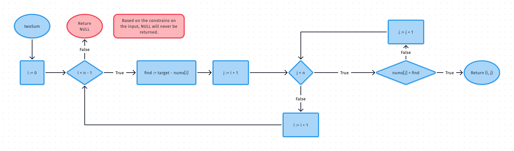
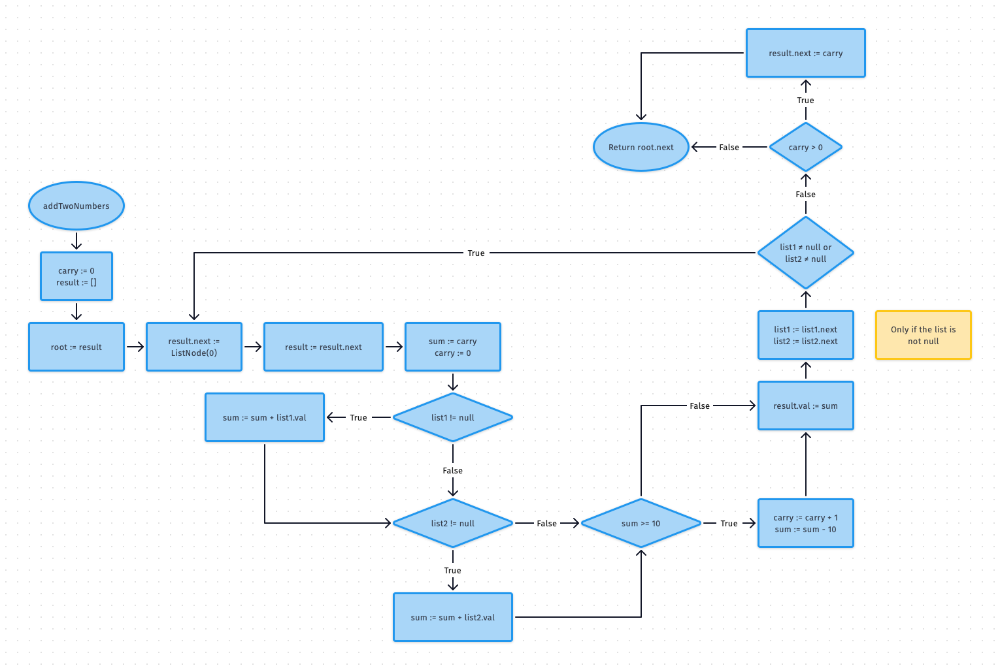

# LeetCode-Java


I usually solve math problems in Python, but I thought to myself, "how can I make my life harder?"... and I found the solution: Solve LeetCode problems using Java

## Table of Contents

1.  [Problem 1: Two Sum](#problem-1-two-sum)
2.  [Problem 2: Add Two Numbers](#problem-2-add-two-numbers)
3.  [Problem 23: Merge Sorted List](#problem-23-merge-sorted-list)
4.  [Problem 164: Maximum Gap](#problem-164-maximum-gap)
5.  [Problem 438: Anagrams](#problem-438-anagrams)
6.  [Problem 1847: Closest Room](#problem-1847-closest-room)
7.  [Problem 2070: Most Beautiful Item for Each Query](#problem-2070-most-beautiful-item-for-each-query)

## Problem 1: Two Sum

> [Two Sum on LeetCode](https://leetcode.com/problems/two-sum/)

**✅ Solution 1**



> Runtime: **56 ms**, faster than **29.63%** of Java online submissions for Two Sum.  
> Memory Usage: **45.3 MB**, less than **8.98%** of Java online submissions for Two Sum.

## Problem 2: Add Two Numbers



> Runtime: **4 ms**, faster than **44.47%** of Java online submissions for Add Two Numbers.
> Memory Usage: **47.6 MB**, less than **11.04%** of Java online submissions for Add Two Numbers.

## Problem 23: Merge Sorted List

> https://leetcode.com/problems/merge-k-sorted-lists/

**Solution 1**

This algorithm is a minimum-select algorithm. Given `n` sorted linked-lists, the resulting root is determined by comparing all of the first elements of each linked list. The next element in the resultant list is found by running the same algorithm, replacing `lists[i]` with `lists[i].next`.

> Runtime: **374 ms**, faster than **5.02%** of Java online submissions for Merge k Sorted Lists.
>
> Memory Usage: **48 MB**, less than **5.33%** of Java online submissions for Merge k Sorted Lists.

## Problem 164: Maximum Gap

**✅ Solution 1**

This is a **hard** problem on LeetCode, but its actually pretty simple. Sort the list, then iterate from `1` to `n-1` and check if `a[i + 1] - a[i]` is greater than the `max`. If it is, replace max with this value.

```java
public class Solution {
    public int maximumGap(int[] nums) {
        if (nums.length < 2)
            return 0;
        Arrays.sort(nums);
        int max = 0;
        int diff;
        for (int i = 0; i < nums.length - 1; i++) {
            diff = nums[i + 1] - nums[i];
            if (diff > max)
                max = diff;
        }
        return max;
    }
}
```

> Runtime: **58 ms**, faster than **35.92%** of Java online submissions for Maximum Gap.  
> Memory Usage: **74.5 MB**, less than **55.62%** of Java online submissions for Maximum Gap.

## Problem 438: Anagrams

🆇 **First Solution**
First I wrote a program which finds all permutations of `p`, then searches for all occurences of each of the anagrams in the base string `s`. This solution was not efficient because it too long to generate all permutations of very long strings.

🆇 **Second Solution**
I modified the previous solution to skip finding all possible anagrams. Let's say the length of `p` is `n`. Then we check each substring of `s` of length `n` (`0` to `n`, `1` to `n+1`, etc). For each substring, we check if `s.substring(i, i + n)` is an anagram of `p`; that is, do they share the same character counts. This solution is not efficient because for extremely large input sizes for either `s` or `p`, counting characters and substringing takes significant time.

✅ **Third Solution**
Replaced the `isAnagram(String, String)` method with a simpler implementation. Since all characters are lowercase letters, there are `26` possible characters. Each index maps to a character from `a` to `z`. Then by iterating through `s1`, we increment each index when the corresponding character is encountered. Then by iterating through `s2`, we decrement each index when the corresponding character is encountered. If the two strings are anagrams, then all values should be exactly `0`.

```java
import java.util.ArrayList;
import java.util.List;

public class Solution {
    public List<Integer> findAnagrams(String s, String p) {
        List<Integer> indices = new ArrayList<>();

        for (int i = 0; i < s.length() - p.length() + 1; i++) {
            if (isAnagram(s.substring(i, i + p.length()), p)) {
                indices.add(i);
            }
        }

        return indices;
    }

    private boolean isAnagram(String s1, String s2) {
        if (s1.equals(s2))
            return true;
        int[] ccount = new int[26];
        for (char c : s1.toCharArray())
            ccount[c - 'a']++;
        for (char c : s2.toCharArray())
            ccount[c - 'a']--;
        for (int n : ccount)
            if (n != 0)
                return false;
        return true;
    }
}
```

> Runtime: **1514 ms**, faster than **5.52%** of Java online submissions for Find All Anagrams in a String.
>
> Memory Usage: **43.5 MB**, less than **54.76%** of Java online submissions for Find All Anagrams in a String.

## Problem 1847: Closest Room

> https://leetcode.com/problems/closest-room/

**Solution 1**

Could not find an efficient solution

## Problem 2070: Most Beautiful Item for Each Query

> [🔗 Most Beautiful Item for Each Query on LeetCode](https://leetcode.com/problems/most-beautiful-item-for-each-query/)

🆇 **Solution 1**

This is a straightforward solution, however, it is not efficient enough. When dealing with large integers and a large input size, the LeetCode time limit is exceeded.

```java
class Solution {
    public int[] maximumBeauty(int[][] items, int[] queries) {
        int[] res = new int[queries.length];

        for (int i = 0; i < queries.length; i++) {
            int n = queries[i];
            int max = 0;
            for (int[] item : items)
                if (item[0] <= n && item[1] > max)
                    max = item[1];
            res[i] = max;
        }

        return res;
    }
}
```

✅ **Solution 2**

I realized that this method would just always take way too long because it has O(n\*i) time. This is bad for a problem which scales so largely. So then I decided to use a hashmap to build a map which increasingly assigns maximum beauty, similar to a napsack problem. Then we add all the queries which do not have a key in the `pToB` map. Then we fill them in by iterating over the sorted keyset and giving all unfilled queries in the map the same value as the previous key.

```java
class Solution {
    public int[] maximumBeauty(int[][] items, int[] queries) {
        Arrays.sort(items, (a, b) -> a[0] - b[0]);
        // Price to (Maximum) Beauty map
        Map<Integer, Integer> pToB = new HashMap<>();
        pToB.put(0, 0);

        // The most maximum beauty acheived so far in sorted items
        int maxBeauty = 0;

        // Iterate through each item and assign a max beauty
        for (int[] item : items) {
            maxBeauty = Math.max(maxBeauty, item[1]);
            pToB.put(item[0], maxBeauty);
        }

        // Iterate through each query and check if is already assigned
        for (int q : queries)
            if (pToB.get(q) == null)
                pToB.put(q, -1);

        Set<Integer> keyset = pToB.keySet();
        int[] keylist = new int[keyset.size()];
        int i = 0;
        for (int n : keyset) {
            keylist[i] = n;
            i++;
        }
        Arrays.sort(keylist);

        for (i = 0; i < keylist.length; i++)
            if (pToB.get(keylist[i]) == -1)
                pToB.put(keylist[i], pToB.get(keylist[i - 1]));

        int[] res = new int[queries.length];
        for (i = 0; i < queries.length; i++) {
            res[i] = pToB.get(queries[i]);
        }

        return res;
    }
}
```

> Runtime: **102 ms**, faster than **40.96%** of Java online submissions for Most Beautiful Item for Each Query.
>
> Memory Usage: **141.2 MB**, less than **12.92%** of Java online submissions for Most Beautiful Item for Each Query.
