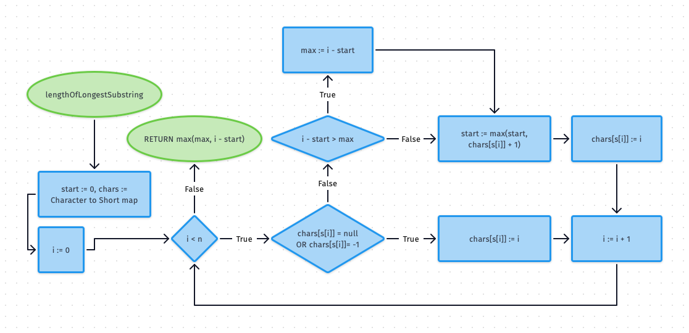
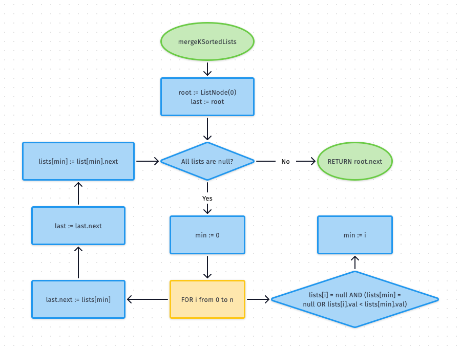
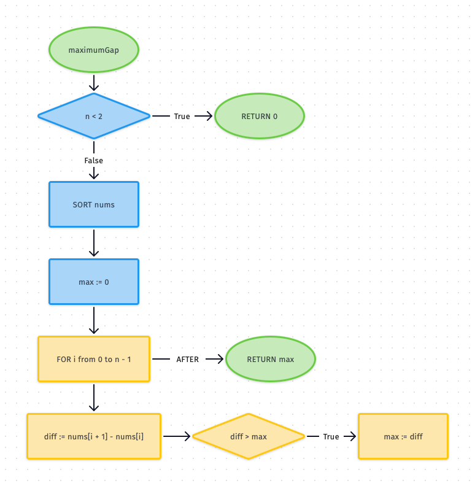
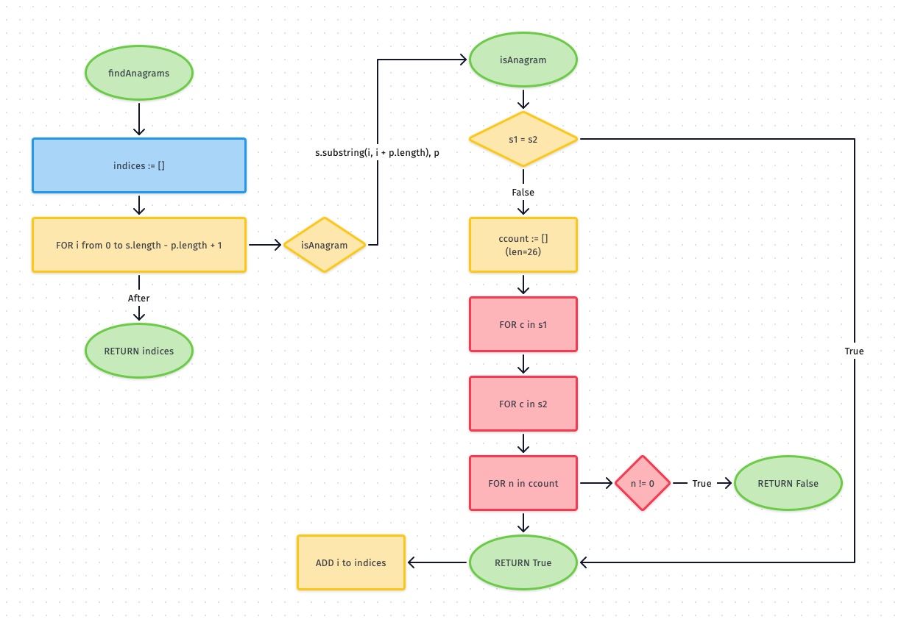

# LeetCode-Java

I usually solve math problems in Python, but I thought to myself, "how can I make my life harder?"... and I found the solution: Solve LeetCode problems using Java

## Table of Contents

1.  [Problem 1: Two Sum](#problem-1-two-sum)
2.  [Problem 2: Add Two Numbers](#problem-2-add-two-numbers)
3.  Problem 3: Longest Substring Without Repeating Characters
4.  [Problem 23: Merge Sorted List](#problem-23-merge-sorted-list)
5.  [Problem 164: Maximum Gap](#problem-164-maximum-gap)
6.  [Problem 438: Anagrams](#problem-438-anagrams)
7.  [Problem 1847: Closest Room](#problem-1847-closest-room)
8.  [Problem 2070: Most Beautiful Item for Each Query](#problem-2070-most-beautiful-item-for-each-query)

## Problem 1: Two Sum

> [Two Sum on LeetCode](https://leetcode.com/problems/two-sum/)  
> [Solution (Code)](jleetcode/src/main/java/org/virajshah/jleetcode/problems/TwoSum1/Solution.java)  
> [Solution (Test)](jleetcode/src/test/java/org/virajshah/jleetcode/problems/TwoSum1/SolutionTest.java)
>
> Runtime: **56 ms**, faster than **29.63%** of Java online submissions for Two Sum.  
> Memory Usage: **45.3 MB**, less than **8.98%** of Java online submissions for Two Sum.

## Problem 2: Add Two Numbers

> [Add Two Numbers on LeetCode](https://leetcode.com/problems/add-two-numbers/)  
> [Solution (Code)](jleetcode/src/main/java/org/virajshah/jleetcode/problems/AddTwoNumbers2/Solution.java)  
> [Solution (Test)](jleetcode/src/test/java/org/virajshah/jleetcode/problems/AddTwoNumbers2/SolutionTest.java)
>
> Runtime: **4 ms**, faster than **44.47%** of Java online submissions for Add Two Numbers.  
> Memory Usage: **47.6 MB**, less than **11.04%** of Java online submissions for Add Two Numbers.

## Problem 3: Longest Substring Without Repeating Characters

> [Longest Substring Without Repeating Characters on LeetCode](https://leetcode.com/problems/longest-substring-without-repeating-characters/)
> Solution (Code)  
> Solution (Test)
>
> Runtime: **14 ms**, faster than **42.57%** of Java online submissions for Longest Substring Without Repeating Characters.
> Memory Usage: **44.5 MB**, less than **23.28%** of Java online submissions for Longest Substring Without Repeating Characters.

## Problem 23: Merge K Sorted List

> [Merge K Sorted List on LeetCode](https://leetcode.com/problems/merge-k-sorted-lists/)  
> [Solution (Code)](jleetcode/src/main/java/org/virajshah/jleetcode/problems/MergeSortedLists23/Solution.java)  
> [Solution (Test)](jleetcode/src/test/java/org/virajshah/jleetcode/problems/MergeSortedLists23/SolutionTest.java)
>
> Runtime: **374 ms**, faster than **5.02%** of Java online submissions for Merge k Sorted Lists.  
> Memory Usage: **48 MB**, less than **5.33%** of Java online submissions for Merge k Sorted Lists.

## Problem 164: Maximum Gap

> [Maximum Gap on LeetCode](https://leetcode.com/problems/maximum-gap/)  
> [Solution (Code)](jleetcode/src/main/java/org/virajshah/jleetcode/problems/MaximumGap164/Solution.java)  
> [Solution (Test)](jleetcode/src/test/java/org/virajshah/jleetcode/problems/MaximumGap164/SolutionTest.java)
>
> Runtime: **58 ms**, faster than **35.92%** of Java online submissions for Maximum Gap.  
> Memory Usage: **74.5 MB**, less than **55.62%** of Java online submissions for Maximum Gap.

## Problem 438: Find All Anagrams in a String

> [Find All Anagrams in a String on LeetCode](https://leetcode.com/problems/find-all-anagrams-in-a-string/)  
> [Solution (Code)](jleetcode/src/main/java/org/virajshah/jleetcode/problems/anagrams438/Solution.java)  
> [Solution (Test)](jleetcode/src/test/java/org/virajshah/jleetcode/problems/anagrams438/SolutionTest.java)
>
> Runtime: **1514 ms**, faster than **5.52%** of Java online submissions for Find All Anagrams in a String.  
> Memory Usage: **43.5 MB**, less than **54.76%** of Java online submissions for Find All Anagrams in a String.

## Problem 2070: Most Beautiful Item for Each Query

> [Most Beautiful Item for Each Query on LeetCode](https://leetcode.com/problems/most-beautiful-item-for-each-query/)  
> [Solution (Code)](jleetcode/src/main/java/org/virajshah/jleetcode/problems/MostBeautifulItem2070/Solution.java)  
> [Solution (Test)](jleetcode/src/test/java/org/virajshah/jleetcode/problems/MostBeautifulItem2070/SolutionTest.java)
>
> Runtime: **102 ms**, faster than **40.96%** of Java online submissions for Most Beautiful Item for Each Query.  
> Memory Usage: **141.2 MB**, less than **12.92%** of Java online submissions for Most Beautiful Item for Each Query.

I will create the flowchart for the algorithm later.
